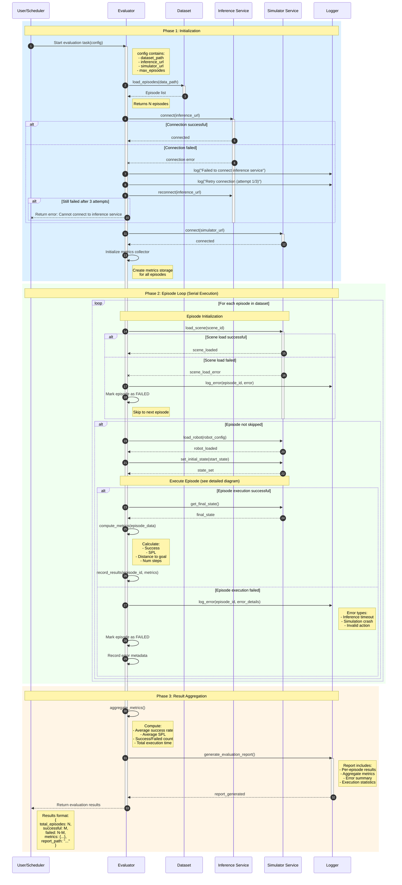

# 整体评测流程时序图

## Overview

此图展示了导航模型评测的完整生命周期，从评测任务启动到结果输出的全流程。

## System Participants

| Participant | Description |
|-------------|-------------|
| **User/Scheduler** | 用户或调度器，发起评测任务 |
| **Evaluator** | 评测器服务，主控服务，负责任务编排和指标计算 |
| **Dataset** | 任务集，包含所有待评测的Episode |
| **Inference** | 推理服务，参赛者部署的模型服务 |
| **Simulator** | 仿真器服务，场景渲染和物理仿真 |
| **Logger** | 日志系统，记录错误和运行日志 |

## Sequence Diagram



## Data Structures

### Input Configuration
```json
{
  "dataset_path": "/data/datasets/objectnav/hm3d_v1/",
  "inference_url": "http://inference-service:8080",
  "simulator_url": "http://simulator-service:9000",
  "max_episodes": 100,
  "max_steps_per_episode": 500,
  "timeout_per_action": 5.0
}
```

### Evaluation Results
```json
{
  "total_episodes": 100,
  "successful": 85,
  "failed": 15,
  "metrics": {
    "success_rate": 0.85,
    "average_spl": 0.72,
    "average_distance_to_goal": 0.35,
    "average_steps": 234.5,
    "total_execution_time": 1250.8
  },
  "failed_episodes": [
    {
      "episode_id": "ep_023",
      "reason": "Inference timeout",
      "step": 127
    },
    {
      "episode_id": "ep_056",
      "reason": "Simulation crash",
      "step": 45
    }
  ],
  "report_path": "/results/evaluation_report_20260311_143052.json"
}
```

## Error Handling Details

| Error Type | Handling Strategy |
|------------|-------------------|
| **Inference connection failed** | Retry 3 times with exponential backoff, then abort |
| **Simulator connection failed** | Retry 3 times, then abort |
| **Scene load failed** | Skip episode, log error, continue to next |
| **Inference timeout** | Use default action (stop), terminate episode |
| **Simulation crash** | Mark episode failed, restart simulator, continue |
| **Metrics computation failed** | Use default values, log warning |

## Key Messages

| Message | Source → Destination | Description |
|---------|---------------------|-------------|
| `load_episodes(path)` | Evaluator → Dataset | Load episode dataset from disk |
| `connect(url)` | Evaluator → Services | Establish connection to services |
| `load_scene(scene_id)` | Evaluator → Simulator | Load 3D scene for episode |
| `load_robot(config)` | Evaluator → Simulator | Load robot configuration |
| `set_initial_state(state)` | Evaluator → Simulator | Set robot start position |
| `compute_metrics(data)` | Evaluator → Evaluator | Internal metrics calculation |
| `aggregate_metrics()` | Evaluator → Evaluator | Aggregate all episode metrics |
| `generate_report()` | Evaluator → Logger | Generate evaluation report |

## Notes

- **Serial Execution**: Episodes are executed one by one to ensure consistent resource usage
- **Fault Tolerance**: Failed episodes do not stop the entire evaluation process
- **Logging**: All errors are logged with sufficient context for debugging
- **Timeout**: Each action has a timeout to prevent hanging
- **Resource Cleanup**: Simulator is reset between episodes

## Related Documents

- [02_single_episode_interaction.md](./02_single_episode_interaction.md) - Detailed single episode interaction
- [README.md](./README.md) - Sequence diagrams overview
