# 单Episode详细交互时序图

## Overview

此图展示了单个Episode内的完整执行流程，包括推理-仿真的详细交互循环。

## System Participants

| Participant | Description |
|-------------|-------------|
| **Evaluator** | 评测器，Episode执行的主控制器 |
| **Simulator** | 仿真器服务，负责环境仿真和状态更新 |
| **Inference** | 推理服务，参赛者的模型服务 |

Note: Timeout and error detection are handled internally by the Evaluator.

## Sequence Diagram

```mermaid
sequenceDiagram
    autonumber
    participant Evaluator as Evaluator
    participant Simulator as Simulator Service
    participant Inference as Inference Service

    rect rgb(220, 240, 255)
        Note over Evaluator,Inference: Phase 1: Episode Initialization

        Evaluator->>Simulator: reset(episode)
        Simulator-->>Evaluator: initial_state
        Note right of Evaluator: state contains:<br/>- observation (rgb, instruction)<br/>- position<br/>- rotation

        Evaluator->>Evaluator: step_count = 0
        Evaluator->>Evaluator: path_length = 0.0
        Evaluator->>Evaluator: is_done = false
        Note right of Evaluator: Initialize metrics accumulators
    end

    rect rgb(240, 255, 240)
        Note over Evaluator,Inference: Phase 2: Inference-Simulation Loop

        loop While is_done == false
            Note over Evaluator,Inference: Step 1: Inference Request

            Evaluator->>Inference: send_observation(observation)
            Note right of Inference: Observation:<br/>{<br/>  "rgb": base64_image,<br/>  "instruction": {...}<br/>}

            alt Inference responds successfully
                Note right of Inference: Model processes<br/>observation and<br/>outputs action list
                Inference-->>Evaluator: action_list
                Note right of Evaluator: Action List:<br/>[<br/>  {"name": "move_forward"},<br/>  {"name": "turn_left"},<br/>  ...<br/>]
            else Timeout or error detected
                Note right of Evaluator: Timeout detected or<br/>inference error occurred
                Evaluator->>Evaluator: action_list = [{"name": "stop"}]
                Evaluator->>Evaluator: is_done = true
            end

            Evaluator->>Evaluator: Continue if not done
        end

        Note over Evaluator,Simulator: Step 2: Execute Action List

        loop For each action in action_list
            Evaluator->>Simulator: step(action)
            Note right of Simulator: Execute action:<br/>- Update physics<br/>- Move robot

            alt Simulation responds successfully
                Simulator-->>Evaluator: distance_moved
                Evaluator->>Evaluator: path_length += distance_moved
            else Simulation error detected
                Note right of Evaluator: Simulation error occurred
                Evaluator->>Evaluator: is_done = true
            end

            alt action.name == "stop"
                Note right of Evaluator: Agent requested<br/>to stop
                Evaluator->>Evaluator: is_done = true
            end
        end

        Note over Evaluator: Step 3: Get Observation and Check Termination

        alt is_done == false
            Evaluator->>Simulator: get_observation()
            Simulator-->>Evaluator: new_observation
            Note right of Evaluator: observation'<br/>contains:<br/>- updated rgb<br/>- instruction

            Evaluator->>Evaluator: step_count += 1
            Evaluator->>Evaluator: observation = observation'

            Note over Evaluator: Check termination conditions

            alt step_count >= max_steps
                Note right of Evaluator: Maximum steps<br/>reached
                Evaluator->>Evaluator: is_done = true
                Evaluator->>Evaluator: stop_reason = "max_steps"
            end
        end
    end

    rect rgb(255, 245, 230)
        Note over Evaluator,Simulator: Phase 3: Episode Completion

        Evaluator->>Simulator: get_final_state()
        Simulator-->>Evaluator: final_state
        Note right of Evaluator: final_state contains:<br/>- final position<br/>- stop_reason

        Evaluator->>Evaluator: compute_metrics()
        Note right of Evaluator: Metrics from accumulators:<br/>- SR: based on stop_reason<br/>- SPL: use accumulated path_length

        Evaluator->>Evaluator: record_episode_results(episode_id, metrics)

        Evaluator->>Simulator: cleanup()
        Note right of Simulator: Reset scene<br/>Free resources

        Note right of Evaluator: Episode completed<br/>ready for next episode
    end
```



## Data Structures

### Episode Input
```json
{
  "episode_id": "ep_001",
  "scene_id": "hm3d_v1_apartment_1",
  "start_state": {
    "position": [1.5, 0.0, 2.3],
    "rotation": [0.0, 0.78, 0.0, 1.0]
  },
  "goals": [
    {
      "object_id": "chair_123",
      "view_points": [[3.2, 0.0, 4.1], ...]
    }
  ],
  "instruction": {
    "text": "Walk to the kitchen and find a chair"
  },
  "max_steps": 500
}
```

### Observation Format
```json
{
  "rgb": "base64_encoded_image_data",
  "instruction": {
    "text": "Walk to the kitchen and find a chair"
  }
}
```

### Action List Format
```json
[
  {"name": "move_forward"},
  {"name": "turn_left"},
  {"name": "move_forward"},
  {"name": "stop"}
]
```

### Episode Results
```json
{
  "episode_id": "ep_001",
  "metrics": {
    "success": true,
    "spl": 0.85
  },
  "stats": {
    "path_length": 15.3,
    "shortest_path_length": 13.0,
    "num_steps": 42,
    "stop_reason": "agent_stop",
    "execution_time": 12.5
  }
}
```

## Termination Conditions

| Condition | Priority | Description |
|-----------|----------|-------------|
| **Agent stop** | 1 | Any action in list has `action.name == "stop"` |
| **Max steps** | 2 | `step_count >= max_steps` |

## Error Handling

| Error Type | Handling |
|------------|----------|
| **Inference timeout** | Use default action `stop`, terminate episode |
| **Inference error** | Use default action `stop`, terminate episode |
| **Simulation error** | Terminate episode, mark as failed |
| **Invalid action** | Skip action, use previous state, log warning |

## Action Space

| Action | Description | Parameters |
|--------|-------------|------------|
| `move_forward` | Move robot forward | distance (default: 0.25m) |
| `turn_left` | Rotate robot left | angle (default: 15 degrees) |
| `turn_right` | Rotate robot right | angle (default: 15 degrees) |
| `stop` | Stop and terminate episode | - |

## Metrics Computation

### Success Rate (SR)
```python
success = (stop_reason == "agent_stop")
```

### SPL (Success weighted by Path Length)
```python
spl = success * (shortest_path_length / max(path_length, shortest_path_length))
```

## Performance Considerations

- **Action Timeout**: Default 5 seconds per inference request
- **Observation Size**: RGB ~30KB (compressed), instruction ~100 bytes
- **Latency Budget**: Target < 100ms per inference for real-time
- **Memory**: No trajectory storage, metrics accumulated incrementally (path_length only)

## Related Documents

- [01_overall_evaluation_flow.md](./01_overall_evaluation_flow.md) - Overall evaluation flow
- [README.md](./README.md) - Sequence diagrams overview
