# 单Episode详细交互时序图

## Overview

此图展示了单个Episode内的完整执行流程，包括推理-仿真的详细交互循环。

## System Participants

| Participant | Description |
|-------------|-------------|
| **Evaluator** | 评测器，Episode执行的主控制器 |
| **Simulator** | 仿真器服务，负责环境仿真和状态更新 |
| **Inference** | 推理服务，参赛者的模型服务 |

Note: Timeout and error detection are handled internally by the Evaluator.

## Sequence Diagram

```mermaid
sequenceDiagram
    autonumber
    participant Evaluator as Evaluator
    participant Simulator as Simulator Service
    participant Inference as Inference Service

    rect rgb(220, 240, 255)
        Note over Evaluator,Inference: Phase 1: Episode Initialization

        Evaluator->>Simulator: reset(episode)
        Simulator-->>Evaluator: initial_state
        Note right of Evaluator: state contains:<br/>- observation<br/>- position<br/>- rotation

        Evaluator->>Evaluator: step_count = 0
        Evaluator->>Evaluator: trajectory = []
        Evaluator->>Evaluator: is_done = false
        Note right of Evaluator: Initialize episode state
    end

    rect rgb(240, 255, 240)
        Note over Evaluator,Inference: Phase 2: Inference-Simulation Loop

        loop While is_done == false
            Note over Evaluator,Inference: Step 1: Inference Request

            Evaluator->>Inference: send_observation(observation)
            Note right of Inference: Observation:<br/>{<br/>  "rgb": base64_image,<br/>  "depth": base64_depth,<br/>  "instruction": {...},<br/>  "gps": [x, y, z],<br/>  "compass": angle<br/>}

            alt Inference responds successfully
                Note right of Inference: Model processes<br/>observation and<br/>outputs action
                Inference-->>Evaluator: action
                Note right of Evaluator: Action:<br/>{<br/>  "name": "move_forward",<br/>  "metadata": {}<br/>}
            else Timeout or error detected
                Note right of Evaluator: Timeout detected or<br/>inference error occurred
                Evaluator->>Evaluator: action = default_action("stop")
                Evaluator->>Evaluator: is_done = true
            end

            alt is_done == false
                Note over Evaluator,Simulator: Step 2: Execute Simulation

                Evaluator->>Simulator: step(action)
                Note right of Simulator: Execute action:<br/>- Update physics<br/>- Move robot<br/>- Render sensors

                alt Simulation responds successfully
                    Simulator-->>Evaluator: new_observation
                    Note right of Evaluator: observation'<br/>contains:<br/>- updated RGB/Depth<br/>- new GPS/Compass
                else Simulation error detected
                    Note right of Evaluator: Simulation error occurred
                    Evaluator->>Evaluator: is_done = true
                end

                Note over Evaluator: Step 3: Record and Check

                alt is_done == false
                    Evaluator->>Evaluator: trajectory.append(observation, action)
                    Evaluator->>Evaluator: step_count += 1

                    Note over Evaluator: Termination Check Phase

                    Evaluator->>Evaluator: Check termination conditions

                    alt action.name == "stop"
                        Note right of Evaluator: Agent explicitly<br/>requested to stop
                        Evaluator->>Evaluator: is_done = true
                        Evaluator->>Evaluator: stop_reason = "agent_stop"
                    else step_count >= max_steps
                        Note right of Evaluator: Maximum steps<br/>reached
                        Evaluator->>Evaluator: is_done = true
                        Evaluator->>Evaluator: stop_reason = "max_steps"
                    else distance_to_goal < threshold
                        Note right of Evaluator: Goal reached
                        Evaluator->>Evaluator: is_done = true
                        Evaluator->>Evaluator: stop_reason = "goal_reached"
                    else collision_detected
                        Note right of Evaluator: Robot collided<br/>with obstacle
                        Evaluator->>Evaluator: is_done = true
                        Evaluator->>Evaluator: stop_reason = "collision"
                    end
                end

                alt is_done == false
                    Note right of Evaluator: Continue to next step
                    Evaluator->>Evaluator: observation = observation'
                end
            end
        end
    end

    rect rgb(255, 245, 230)
        Note over Evaluator,Simulator: Phase 3: Episode Completion

        Evaluator->>Simulator: get_final_state()
        Simulator-->>Evaluator: final_state
        Note right of Evaluator: final_state contains:<br/>- final position<br/>- final rotation<br/>- distance to goal

        Evaluator->>Evaluator: compute_metrics(trajectory)
        Note right of Evaluator: Metrics to compute:<br/>- Success: goal_reached<br/>- SPL: efficiency metric<br/>- Distance to goal<br/>- Num steps<br/>- Execution time

        Evaluator->>Evaluator: record_episode_results(episode_id, metrics)

        Evaluator->>Simulator: cleanup()
        Note right of Simulator: Reset scene<br/>Free resources

        Note right of Evaluator: Episode completed<br/>ready for next episode
    end
```



## Data Structures

### Episode Input
```json
{
  "episode_id": "ep_001",
  "scene_id": "hm3d_v1_apartment_1",
  "start_state": {
    "position": [1.5, 0.0, 2.3],
    "rotation": [0.0, 0.78, 0.0, 1.0]
  },
  "goals": [
    {
      "object_id": "chair_123",
      "view_points": [[3.2, 0.0, 4.1], ...]
    }
  ],
  "instruction": {
    "text": "Walk to the kitchen and find a chair"
  },
  "max_steps": 500
}
```

### Observation Format
```json
{
  "rgb": "base64_encoded_image_data",
  "depth": "base64_encoded_depth_map",
  "instruction": {
    "text": "Walk to the kitchen and find a chair"
  },
  "gps": [1.5, 0.0, 2.3],
  "compass": 0.78,
  "step": 42
}
```

### Action Format
```json
{
  "name": "move_forward",
  "metadata": {
    "distance": 0.25
  }
}
```

### Episode Results
```json
{
  "episode_id": "ep_001",
  "success": true,
  "spl": 0.85,
  "distance_to_goal": 0.15,
  "num_steps": 127,
  "stop_reason": "goal_reached",
  "execution_time": 12.5,
  "trajectory": [
    {
      "step": 0,
      "observation": {...},
      "action": {"name": "turn_left"}
    },
    {
      "step": 1,
      "observation": {...},
      "action": {"name": "move_forward"}
    },
    ...
  ]
}
```

## Termination Conditions

| Condition | Priority | Description |
|-----------|----------|-------------|
| **Agent stop** | 1 | Agent explicitly sends `action.name == "stop"` |
| **Goal reached** | 2 | Distance to goal < success_threshold (e.g., 0.2m) |
| **Max steps** | 3 | `step_count >= max_steps` |
| **Collision** | 4 | Robot collides with obstacle (optional) |

## Error Handling

| Error Type | Handling |
|------------|----------|
| **Inference timeout** | Use default action `stop`, terminate episode |
| **Inference error** | Use default action `stop`, terminate episode |
| **Simulation error** | Terminate episode, mark as failed |
| **Invalid action** | Skip action, use previous state, log warning |

## Action Space

| Action | Description | Parameters |
|--------|-------------|------------|
| `move_forward` | Move robot forward | distance (default: 0.25m) |
| `turn_left` | Rotate robot left | angle (default: 15 degrees) |
| `turn_right` | Rotate robot right | angle (default: 15 degrees) |
| `stop` | Stop and terminate episode | - |

## Metrics Computation

### Success
```python
success = (distance_to_goal < success_threshold) and (stop_reason in ["agent_stop", "goal_reached"])
```

### SPL (Success weighted by Path Length)
```python
spl = success * (shortest_path_length / actual_path_length)
```

### Distance to Goal
```python
distance_to_goal = euclidean_distance(agent_position, goal_position)
```

## Performance Considerations

- **Action Timeout**: Default 5 seconds per action
- **Observation Size**: RGB ~30KB, Depth ~15KB (compressed)
- **Latency Budget**: Target < 100ms per action for real-time
- **Memory**: Full trajectory stored for debugging (optional)

## Related Documents

- [01_overall_evaluation_flow.md](./01_overall_evaluation_flow.md) - Overall evaluation flow
- [README.md](./README.md) - Sequence diagrams overview
