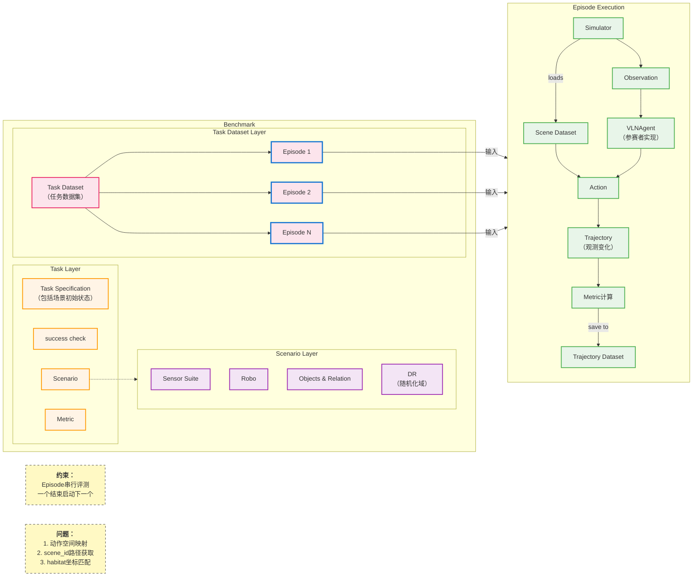

# 评测系统架构图

## Overview

此图展示了评测系统的整体架构，分为两大核心模块：Benchmark（任务配置层）和 Episode Execution（执行流程层）。

## Architecture Diagram

## Module Descriptions

### Benchmark Module

**Task Layer (任务层)**
- **Task Specification**: 任务定义，包含场景初始状态
- **success check**: 成功判定条件
- **Scenario**: 场景定义
- **Metric**: 评估指标

**Scenario Layer (场景层)**
- **Sensor Suite**: 传感器套件配置
- **Robo**: 机器人配置
- **Objects & Relation**: 物体与关系定义
- **DR (Domain Randomization)**: 随机化域

**Task Dataset Layer (任务数据集层)**
- **Task Dataset**: 包含多个 Episode 的数据集
- **Episode**: 单个评测任务实例

### Episode Execution Module

执行流程数据流：
1. **Simulator** → **Observation**: 模拟器生成环境观测
2. **Simulator** loads **Scene Dataset**: 加载场景数据
3. **Scene Dataset** → **Action**: 场景驱动动作生成
4. **Observation** → **VLNAgent**: Agent 接收观测输入
5. **VLNAgent** → **Action**: Agent 输出动作
6. **Action** → **Trajectory**: 动作执行产生轨迹变化
7. **Trajectory** → **Metric计算**: 基于轨迹计算指标
8. **Metric计算** save to **Trajectory Dataset**: 保存评测结果

## Constraints

- **串行执行**: Episode 串行评测，一个 episode 结束后启动下一个

## Open Issues

1. **动作空间映射**: 任务动作空间到机器人状态的映射，是否可独立为 Action Processor（或对接 RTC）
2. **场景路径获取**: benchmark 中 scene_id 对应的场景文件路径获取方式（是否为 OBS 地址）
3. **坐标匹配**: habitat 生产的任务集坐标是否与 ME 模块不匹配

## Related Documents

- [01_overall_evaluation_flow.md](./sequence_diagrams/01_overall_evaluation_flow.md) - 整体评测流程时序图
- [02_single_episode_interaction.md](./sequence_diagrams/02_single_episode_interaction.md) - 单Episode详细交互时序图
- [task_interface_design.md](./task_interface_design.md) - 任务接口设计
